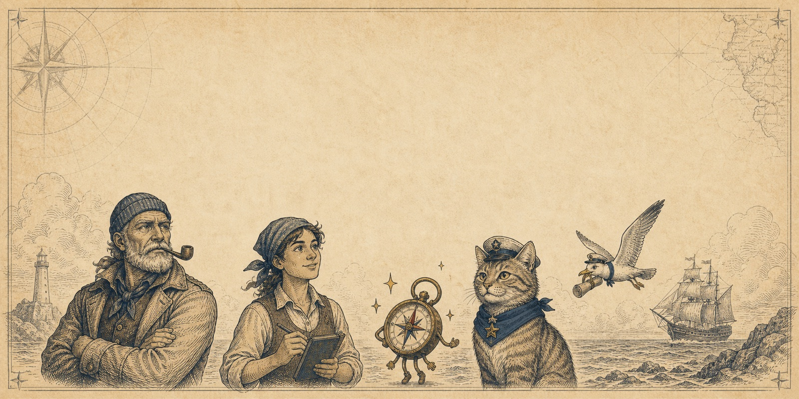

<p align="center">
  
</p>

<h1 align="center">Deckhand</h1>

<p align="center"><em>Resourceful. Loyal. Always on watch.</em></p>

<p align="center"><a href="https://deckhandforanki.com"><strong>deckhandforanki.com</strong></a></p>

<p align="center">
  <a href="https://github.com/bentoware/deckhand/releases/latest"></a>
  <a href="https://github.com/bentoware/deckhand/actions/workflows/release.yml"></a>
  <a href="LICENSE"></a>
</p>

Deckhand is an Anki add-on that gives your AI assistant a pair of careful hands inside your collection. Claude, Codex, or any MCP client can finally *see* your decks — what's due, what's leeching, what that half-finished note actually says — and help you fix it, with you at the wheel the whole time.

Everything runs on your computer. No cloud, no account, no sync service. Just your Anki, your assistant, and a small crew member keeping watch between them.

## The problem with AI and Anki

If you've ever tried to get an AI to help with your flashcards, you know the drill:

- **Your assistant is blind.** You paste cards out, paste suggestions back, and lose an evening to clipboard archaeology.
- **Making good cards is slow.** That 40-page PDF wants to be 60 atomic, cited cards. By hand, it'll stay a PDF.
- **Bulk fixes are terrifying.** Retagging 800 notes or repairing a mangled field across a deck is exactly the kind of job you want help with — and exactly the kind you don't want done blind.
- **The existing tooling is for tinkerers.** Most bridges assume you enjoy editing JSON config files at midnight.

Deckhand's answer: put the assistant *inside* the live Anki runtime, behind a guarded, standard MCP surface — then make connecting it something a normal person can do in under a minute.

## What you get

- **An assistant that sees your real deck.** Live context: current card, browser selection, editor fields, due counts, deck stats. No exports, no stale snapshots.
- **One-minute setup, no terminal required.** A welcome dialog on first launch, copy-paste recipes for every major client — and for Claude Desktop, you literally **drag a card out of Anki and drop it into Claude**. That's the whole install.
- **A crew of study skills.** Bundled workflows teach your assistant proven Anki craft: PDF→cards with citations, language decks, leech rescue, card polish, weak-card triage. One click installs them for Claude Code or Codex; they quietly stay current with the [deckhand-skills](https://github.com/bentoware/deckhand-skills) repo and never overwrite your edits.
- **Built-in troubleshooting.** A Status tab that tests every link in the chain and tells you the *one* thing to fix. A diagnostics button that copies everything a bug report needs.
- **Guardrails you can see.** Lean default tool surface, read-before-write design, risky tools flagged with standard MCP annotations, and an optional access token if loopback-only isn't enough for you.

<p align="center">
  
</p>

## Quickstart

1. **Install the add-on** — grab `deckhand.ankiaddon` from the [latest release](https://github.com/bentoware/deckhand/releases/latest), then in Anki: *Tools → Add-ons → Install from file…*
2. **Restart Anki.** The welcome dialog takes it from there. (Missed it? *Deckhand → Onboarding* replays it anytime.)
3. **Connect your assistant** from *Deckhand → Management → Connect*:
   - **Claude Desktop** — drag the `Deckhand.mcpb` chip straight into the Claude window and click Install. Done.
   - **Claude Code** — install the plugin (connection + skills in one go): `claude plugin marketplace add bentoware/deckhand && claude plugin install deckhand@bentoware`. Last resort, bare MCP only: `claude mcp add --transport http deckhand http://127.0.0.1:28765/mcp`
   - **Codex CLI** — install the plugin: `codex plugin marketplace add https://github.com/bentoware/deckhand && codex plugin add deckhand@deckhand`. Fallback: copy the `config.toml` MCP block.
   - **Codex Desktop** — open Plugins, click `+` → Add marketplace, paste `https://github.com/bentoware/deckhand`, then open the Deckhand tab and click Add. Fallback: copy the `config.toml` MCP block.
   - **Anything else** that speaks Streamable HTTP MCP — paste the endpoint URL.
4. **Say something.** "What's due today?" "Turn this PDF into cards." "Find my leeches and tell me why they keep sinking."

## On watch, not in charge

Deckhand is built around a simple idea: *the assistant crews the ship; you captain it.*

- Runs entirely on **loopback** — nothing leaves your machine.
- The default MCP surface is **deliberately small**; the full tool inventory is opt-in from the developer panel.
- Mutating and destructive tools carry **standard MCP annotations**, so well-behaved clients confirm before acting.
- Want a lock on the hatch? Flip on **"Require access token"** in the Server tab — the Claude Desktop extension carries the key automatically.
- Updates **ask first**. Skills updates never touch anything you've hand-edited.

## For developers

```sh
make check          # generated-inventory check, Python tests, Rust tests
make build          # debug build of the Rust companion
make run-anki       # sync Deckhand into local Anki and restart the latest installed Anki app
make package-addon  # dist/deckhand.ankiaddon with the companion bundled
make inspect-mcp    # MCP Inspector against the live endpoint
```

The add-on (Python, `addon/deckhand/`) handles Anki-safe access to decks, notes, cards, media, and UI context. A small Rust companion (`crates/deckhand-server/`) exposes it all as a Streamable HTTP MCP server on `http://127.0.0.1:28765/mcp`. Rendered-UI work goes through `anki_run_python` and the bundled `deckhand.web` SDK (start Anki with `QTWEBENGINE_REMOTE_DEBUGGING=9222` or click "Restart Anki for Deckhand").

Releases are automated: bump `version.py` + `manifest.json`, write `releases/Release-<version>.md`, push a `v*` tag — CI builds the four-platform package, the `.mcpb`, and publishes the release. See [CONTRIBUTING.md](CONTRIBUTING.md) and [SECURITY.md](SECURITY.md).

## License

[AGPL-3.0-or-later](LICENSE) — the license AnkiWeb expects of add-ons that extend Anki Desktop, and the one that keeps this hull inspectable from stem to stern. Dependency notes live in [THIRD_PARTY_NOTICES.md](THIRD_PARTY_NOTICES.md).

## Backups and AI-assisted changes

Deckhand gives AI assistants careful access to your local Anki collection, but AI-generated suggestions and tool calls can still be wrong. Review changes before applying them, and create an Anki backup before bulk edits, deletes, imports, template changes, or scheduling changes.

Deckhand is provided as-is, without warranty, to the extent permitted by applicable law. The authors and contributors are not liable for lost data, damaged decks, incorrect study material, or other damages arising from use of the software or AI-assisted workflows.

---

<p align="center"><em>Deckhand doesn't promise magic. It promises better watchkeeping:<br/>clear tools, visible context, and no more blind edits in the dark.</em></p>
